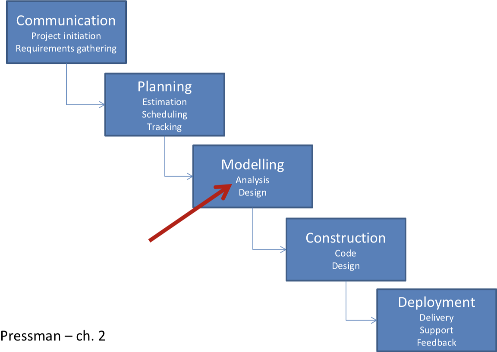
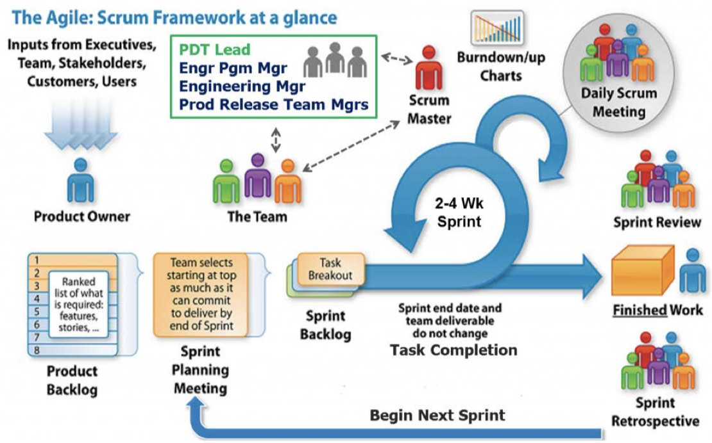
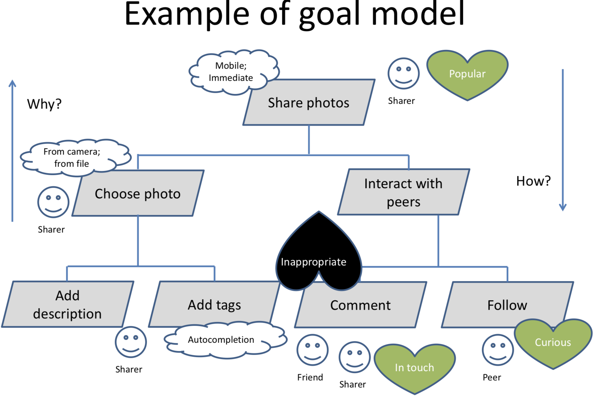

# Software Requirements Analysis Notes

Summary is wriiten by Yixiong Ding  
The University of Melbourne  
June, 2018   
_ _ _

## Interviews
_ _ _

### Communication principles
1. Listen to the client
2. Prepare yourself
3. Have a facilitator
4. Best face to face
5. Take notes
6. Collaboration
7. Stay focused
8. Always move on
9. Not a contest

### Types of interviews
1. Structured interviews
    - More focused
2. Unstructured interviews
    - Might identify unexpected issues
3. Semi-structured interviews

### General interviewing protocol
1. Identify candidate
    - What data are you after?
    - Need to understand the organisation
2. Plan interview
    - What do you want to get out of it?
    - Learn about the domain and terminology
3. Conduct interview
    - Follow up answers
    - Ask questions and record answers
4. Analyse results
    - And go back to interviewee to get feedback/validation

### Interviewing guidelines
1. Identify complete set of stakeholders
2. Establish rapport
3. Friend not foe
4. Focus on the interviewee work and problems
5. Keep open ended questions for the end
6. Follow up interesting answers
7. Ask the ‘why’ of pre-established solutions
8. Avoid questions
    - Opinionated or biased
    - Imply an answer
    - You know the answer
    - Silly – answered by previous research
9. Look at the data soon before you forget non-verbal factors
10. Keep people in the loop
11. Never say “usually”
12. Encourage stories
13. Find inconsistencies
14. Non-verbal cues
15. Don’t fear silence

_ _ _
## Software Processes
_ _ _

### Software projects
1. Software projects replace existing systems (even if a manual one)
2. The system-as-is vs the system-to-be
    - Often the system-to-be will interact with other software, people and processes
3. “Easy” vs “hard” problem domains 
    - Get to know the problem domain 
    - Share the client's lexicon

### Why building a system?
1. Students often not exposed to the Business Brief
2. Motivation of the system-to-be
    - Why is it necessary?
    - Goals?
    - How does it fit in the business strategy?
3. Define the boundaries software/system 
    - System > Software 
4. Scope and scope creep 
    - Prioritise!

### A classic waterfall process

### Requirements Engineering
1. Finding out what the client wants
2. Foundation for rest of development
3. Requirements engineering
    - Repeatable process of gathering and refining requirements
4. Harder than it looks like
    - Communication with client essential

### A classic RE process
1. Inception
    - Basic understanding of the problem, identify the people who want the solution, the nature of the solution
2. Elicitation
    - What is to be accomplished, how the system fits into the needs of the business, and how the system will be used on a day-to-day basis
3. Specification/Modelling
    - Refining the elicited data as requirements models
4. Negotiation
    - Scoping with client, bringing together various viewpoints, resolving conflicting requirements, prioritizing requirements
5. Validation
    - Ensuring the specification is correct, unambiguous, and free of inconsistencies. Validate with stakeholders to establish baseline
6. Requirementsmanagement
    - Maintain changes in requirements throughout the lifecycle of the system

### An agile process

### An agile inception
1. Helps reach alignment and set expectations
2. Team gets ready to start a project
3. Typically a 1 or 2 day meeting
4. Involves dev team and clients
5. Elements:
    - Vision and goals
        - Motivation of the project and main goals
    - Non-goals
        - What’s out of scope
    - Risks
        - Brainstorm, prioritise and revisit
    - Roles / personas
    - Activities / workflows
    - Stories
        - Later decomposed into tasks
    - Estimations
    - Priorities
    - Retrospective

_ _ _
## Goal modelling
_ _ _

### Models
1.  Abstraction from real world
    - Support the understanding of some aspect
2. They represent information needed for the development
    - Do not over-elaborate
    - Stop when there is a base for design
3.  Support discussion between stakeholders
4. Empowering
    - Brings you closer to the final product

### Do, be, feel lists
1. One efficient way of eliciting requirements
    - Complementary to interviews
2.  Structured form of brainstorming
3. A workshop activity involving many stakeholders
    - Can capture viewpoints or partial views of the problem

#### Preparation
 1. Participants
    - Facilitator: run the activity
    - Scribe: write down participant’s suggestions
    - Range of stakeholders involved in the problem
2. Resources
    - Markers (3 different colours if possible)
    - Whiteboard or similar – 15 to 30 minutes

#### Introducing the activity
1. Explain purpose of the session(project purpose)
2. Explain the 4 categories
    1. Do
        - What should the system do?
    2. Be 
        - How should it be done? Constraints on features
    3. Feel
        - Emotional (or social) considerations or concerns regarding features
    4. Who
        - Types of stakeholders involved in the system

#### Populating the lists
1. Ask the audience for contributions
2. Write down ideas under the right category 
    - Different colours for different categories?
3. No strict order
4. Brainstorming principles, e.g. no filtering out

#### Prioritising
1. Optionally end the activity extracting priorities
    - Longer session
2. Many different techniques
    - Pick a lean technique
3. Do it now or later
    - If later, your ideas will be clearer
    - If now, stakeholders have the discussion fresh and are together to discuss inconsistent perceptions

#### Close the activity
1.  Record the results
    - Photo? Counting dots?
2. Thank participants
3. Explain the process
    - Analysis of result
    - Return to them for clarification and feedback

### Goal model
1. Visual representation of goals and involved actors
2. In traditional software engineering
    - Semi-formal specification
    - Used to derive other lower level models leading to design
3. Our purpose
    - Conversation starter between client and dev team
    - Represents shared understanding of the problem
    - Notation easy to understand for non-technical stakeholders
4. Two possible levels
    1. Motivate the project, describe the problem
    2. Describe general aspects of the sought system (non-technical!)
5. 1 and 2 combined in one diagram in some cases

#### Elements of a goal model
1. Functional goals
    - High level functional requirements 
    - Parallelograms
    - Actions – start with verbs
2. Quality goals
    - Non-functional requirements
    - Clouds
    - Adjectives – qualify the functionalities
3. Emotional goals
    - Social issues, personal values, non-traditional quality requirements 
    - Hearts
    - I want to feel...
4. Concerns
    - Risks, conflicting views... - things to take into account during the project – Spades, inverted hearts
5. Roles
    - Actors responsible for goals or involved in them

#### Hierarchy of functional goals
1. Top-down
    - More general to more specific
    - Answer how the super-goal will be achieved/decomposed?
2. Bottom-up
    - Specific to general
    - Answer why the sub-goal is done?

#### Example of goal model

### Starting point
1. A collection of key concepts in the domain
    - From interview analysis
    - From other elicitation mechanisms 
        - E.g. do, be, feel lists
2. Review as a teamf or
    - Ambiguities – multiple interpretations
    - Redundancy
    - Need for clarification
3. Note all assumption to check with clients later

### Do, be, feel lists / goal model mapping
If using the list workshop
1. Do list
    - unctional goals
2. Be list
    - quality goals
    - Traditional non-functional requirements
        - Performance, security, robustness, reliability...
    - Other quality factors (some might be related to the above 
    - Mobile, visual, immediate
3. Feel list
    - emotional goals 
    - concerns/risks
    - Engaged, empowered, connected, hopeful, normal
4. Who list 
    - roles

### Creating the hierarchy
### Adding qualities and emotions
### Feedback from the client
### Frequent issues

_ _ _
## Personas
_ _ _

### What are personas?
1.  A model of users
    - Not real but based on real data
2. Describe a group of users
    - What they want to accomplish 
    - What are their motivations
    - How they behave
    - How they think
3. Informtheproductdesign 
    - Ideation
    - Validation of design concepts

### Choosing your audience
1. Designing broad functionalities to reach a wide audience
    - Many features
    - Increase cognitive load
    - Make the interaction harder
2. Choose right individuals to design for 
    - Represent the needs of large groups
    - Prioritise their needs
    - If possible satisfy secondary users

### Strengths of personas
1.  Determine what the product should do and how it should behave
2. For discussion with stakeholders – simple
3. “In vitro” user testing
4. Marketing tools
5. Avoid
    - Designing for a generic user
    - Developer’s goals
    - Edge cases – how often this function will be used?

### Effectiveness of personas
1. Based on research on real people
2. Engage the empathy of the design and the development team around the users’ goals
3. If well done make developers care more about making them happy with a better experience

### Personas are not...
1. Not anaverage user
    - Exemplary or definite behaviour within the range 
    - E.g. make between $50k-$70k p.a.
2. Not stereotypes
    - Antithesis of well-developed personas
    - Result of the developers’ biases and assumptions – E.g. all older adults are bad with technology
3. If not sufficient evidence
    - Might need supplementary data
    - Err on the side of diversity (gender, ethnic, age...)

### A complete process for persona creation
1. Group interview subjects by role
2. Identify behavioural variables
3. Map interview subjects to behavioural variables
4. Identify significant behaviour patterns
5. Synthesize characteristics and define goals
6. Check for completeness and redundancy
7. Designate persona types
8. Expand the description of attributes and behaviours

### Goals of personas
1. Goals are drivers(motivations) behind people’s behaviours
    - Why does somebody perform certain tasks?
    - Personas must have goals related to the system
2. Answer to why and how a persona would use a product
    - Great help for the developer to keep the big picture
3. Identified and summarised in one sentence
4. 3 types of goals related to how we process emotions

### How does our brain process emotions?
Three levels:
1. Visceral
    - Look&Feel
    - Immediate impact, fast
    - Consistent for most people
2. Behavioural
    - Use and experience of a product
    - Related to functionality, performance and usability 
    - Consistent for most people
3. Reflective
    - Meaning of a product and its use, over time 
    - Related to culture and self-image
    - Non-consistent for most people

#### Personas’ experience goals
1. Visceral level of cognitive processing
2. Visual appearance and other senses
    - Designing for affect – emotional response for the particular context
    - Often beautiful, but not always (E.g. music player VS banking app)
3. How the user wants to feel
    - Smart, in control, fun, reassured about security, relaxed, focused and alert...

#### Personas’ end goals
1. Behavioural level of cognitive processing
2. The behaviour of the system should complement the users’ behaviour and mental process
3. What the user wants to do (motivation for using the system)
    - Be aware of problems before they become critical 
    - Stay connected with friends
    - Find music that I love
    - Get the best deals

#### Personas’ life goals
1. Reflective level of cognitive processing
2. Designing for building long-term relationships
    - Very hard to create personal or cultural associations 
        - Sony Walkman, iPhone, Facebook
3. Who the user wants to be
    - Deep drives and motivations
    -  Explains why the user wants to achieve the end goals
        - Live the good life
        - Succeedinmyambitionsto...
        - Be attractive, popular, respected...
4. They won’t directly affect the development but a system that gets people closer to their life goal will be highly successful

### Behavioural patterns
1. How does somebody behave in relation to some aspect relevant for the system?
2. Each behavioural pattern covered by a different persona
3. Avoid redundant behavioural patterns – If two personas behave similarly
    - No value to understand more about the system – In some cases redundancy is useful
4. Based on behavioural variables

#### Behavioural variables
1. Useful to find the behavioural patterns
    - Typically not just demographics
2. They hold a range of values
    - E.g.Education: Noeducation, Secondary, Undergrad, Postgrad, PhD
        - Discrete values
    - E.g.Computer use skill: Value between not at all to highly skilled
        - Continuous 
3. Look at
    - Activities: what the user does, how often
    - Attitudes: what the user thinks about domain and technology 
    - Aptitudes: users’ education and learning ability
    - Motivation: why is the user engaged in the problem
    - Skills: users’ abilities related to domain and technology
#### Significant behavioural patterns
1. Based on real data
    - Identify relevant behavioural variables
    - Define behavioural patterns as combination of variables values with logical connection
2. E.g. a music app
    - Doing sports more than 3 times per week, listening to music while being active
    - Doing sports less than once per week, listening to music to relax
3. Can you eliminate behaviours and get the same result?   
    - Irrelevant variables for persona creation
    - Compare
        - Listening to music and regularly buying music 
        - Listening to music and being vegetarian
### Defining a persona

### Types of personas

#### Primary
1. Main target, one per interface
    -  E.g. healthcare IS, one for medical, one for financial
2. The primary person must be satisfied with the design • Other personas will not be dissatisfied
3. If unclear which one is the primary persona, define multiple interfaces
4. If there are several primary personas for a customer product, the scope is too broad
5. The primary persona is not necessarily the largest segment market
    - E.g. OXO Good Grips for people with arthritis

#### Secondary
1. Mostly satisfied with the primary persona’s interface
2. Additional needs that do not upset the primary persona’s – Not always necessary
3. Design first for the primary then adjust for the secondary

#### Supplemental
1. Their needs are represented by a combination of those for
2. No need for further adjustment
3. Political personas are a good example of this 
    - To address stakeholders assumptions
4. Others: customer, served or negative

### Personas in the development lifecycle
 Use your personas!
1. Ideation
    - Talk about the functionality that they need
2. Base the design on their particularities 
3. Sounding board while designing
    - Would Peter like this? 
4. Evaluation
    - Pre-user testing 
5. Sell your product
    - Present your work to client or third parties

_ _ _
## Paper prototypes
_ _ _

### Paper interfaces
1. Quick drawing of the interface
2. Users test it
    - Explain scenario
    - Ask them to perform a task
2. Encourage users to talk aloud 
    - Explain their intentions
    - Explain their actions 
    - Ask questions
3. Take notes! (or video)

### Interactive paper interfaces
1. Static VS Interactive
2. Very simple technique
3. Interactions cause changes 
    - Replace the sketch
4. Example of mechanism (Buxton) 
    - No content
    - Focus on interaction 
    - Easy to replicate

### Use them for ideation
### Use them for early user testing
### Use them for usability testing
### Paper prototypes for co-design
1. Collaborate with the client to create the paper prototype
    - Hand-drawn, not printed
2. Bring screen templates and cut-outs of interface elements
    - Buttons, search bars, maps...
    - If in a rush, find mockups of elements in the Internet
3. Work with the client to position them 
    - Encourage think-aloud
4. Create more elements on the fly 
    - Be prepared with paper, pens...
5. End up with a “perfect interface” for the client
### On multiple versions
### How people think
### Wrapping up
1. Intended to be rough sketches
    - Reinforces the idea of not being finished • Don’t use a computer if possible
    - Very quick
        - A couple of minutes to draw an interface 
        - Don’t use rulers (make them look rough)
    - Make many of them and throw them away
2. Make a very inexpensive prototype
3. Affordable to compare alternative solutions